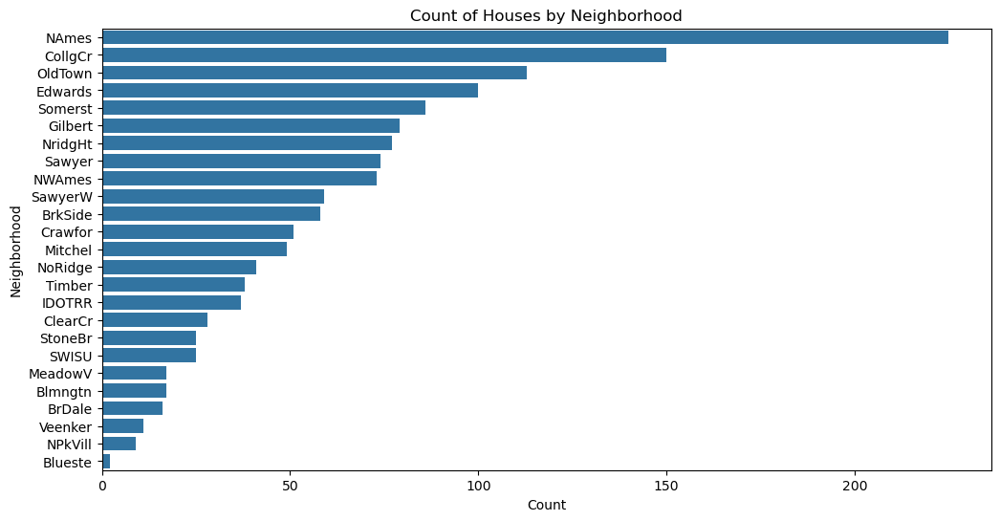
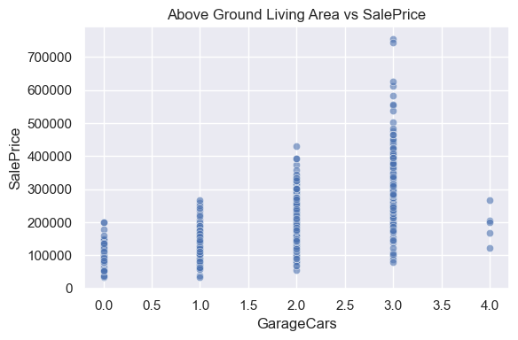

# House Prices - Advanced Regression Techniques

The purpose of this EDA notebook is to explore advanced regression techniques to predict housing prices using the Ames, Iowa dataset provided by Kaggle.  I will explore the data to understand the most important features that affect home prices and check for missing values or outliers.

## Dataset Overview
### Brief descrption of the columns in this dataset: 

This dataset contains from Kaggle contains information on 1,460 residential homes in Ames, Iowa, collected during the years 2006 to 2010. The dataset includes 81 features that describe different aspects of each house.

Here's a brief version of what you'll find in the data description file.

- **SalePrice**: the property's sale price in dollars. This is the target variable that you're trying to predict.
- **MSSubClass**: The building class
- **MSZoning**: The general zoning classification
- **LotFrontage**: Linear feet of street connected to property
- **LotArea**: Lot size in square feet
- **Street**: Type of road access
- **Alley**: Type of alley access
- **LotShape**: General shape of property
- **LandContour**: Flatness of the property
- **Utilities**: Type of utilities available
- **LotConfig**: Lot configuration
- **LandSlope**: Slope of property
- **Neighborhood**: Physical locations within Ames city limits
- **Condition1**: Proximity to main road or railroad
- **Condition2**: Proximity to main road or railroad (if a second is present)
- **BldgType**: Type of dwelling
- **HouseStyle**: Style of dwelling
- **OverallQual**: Overall material and finish quality
- **OverallCond**: Overall condition rating
- **YearBuilt**: Original construction date
- **YearRemodAdd**: Remodel date
- **RoofStyle**: Type of roof
- **RoofMatl**: Roof material
- **Exterior1st**: Exterior covering on house
- **Exterior2nd**: Exterior covering on house (if more than one material)
- **MasVnrType**: Masonry veneer type
- **MasVnrArea**: Masonry veneer area in square feet
- **ExterQual**: Exterior material quality
- **ExterCond**: Present condition of the material on the exterior
- **Foundation**: Type of foundation
- **BsmtQual**: Height of the basement
- **BsmtCond**: General condition of the basement
- **BsmtExposure**: Walkout or garden level basement walls
- **BsmtFinType1**: Quality of basement finished area
- **BsmtFinSF1**: Type 1 finished square feet
- **BsmtFinType2**: Quality of second finished area (if present)
- **BsmtFinSF2**: Type 2 finished square feet
- **BsmtUnfSF**: Unfinished square feet of basement area
- **TotalBsmtSF**: Total square feet of basement area
- **Heating**: Type of heating
- **HeatingQC**: Heating quality and condition
- **CentralAir**: Central air conditioning
- **Electrical**: Electrical system
- **1stFlrSF**: First Floor square feet
- **2ndFlrSF**: Second floor square feet
- **LowQualFinSF**: Low quality finished square feet (all floors)
- **GrLivArea**: Above grade (ground) living area square feet
- **BsmtFullBath**: Basement full bathrooms
- **BsmtHalfBath**: Basement half bathrooms
- **FullBath**: Full bathrooms above grade
- **HalfBath**: Half baths above grade
- **Bedroom**: Number of bedrooms above basement level
- **Kitchen**: Number of kitchens
- **KitchenQual**: Kitchen quality
- **TotRmsAbvGrd**: Total rooms above grade (does not include bathrooms)
- **Functional**: Home functionality rating
- **Fireplaces**: Number of fireplaces
- **FireplaceQu**: Fireplace quality
- **GarageType**: Garage location
- **GarageYrBlt**: Year garage was built
- **GarageFinish**: Interior finish of the garage
- **GarageCars**: Size of garage in car capacity
- **GarageArea**: Size of garage in square feet
- **GarageQual**: Garage quality
- **GarageCond**: Garage condition
- **PavedDrive**: Paved driveway
- **WoodDeckSF**: Wood deck area in square feet
- **OpenPorchSF**: Open porch area in square feet
- **EnclosedPorch**: Enclosed porch area in square feet
- **3SsnPorch**: Three season porch area in square feet
- **ScreenPorch**: Screen porch area in square feet
- **PoolArea**: Pool area in square feet
- **PoolQC**: Pool quality
- **Fence**: Fence quality
- **MiscFeature**: Miscellaneous feature not covered in other categories
- **MiscVal**: $Value of miscellaneous feature
- **MoSold**: Month Sold
- **YrSold**: Year Sold
- **SaleType**: Type of sale
- **SaleCondition**: Condition of sale

## Exploratory Data Analysis (EDA):

- Perform univariate, bivariate, and multivariate analysis.
- Generate relevant graphs to formulate hypotheses.
- Using visualizations to explore patterns and relationships.

### Univariate Analysis - Histogram & Countplot

### Bivariate Analysis - Barplot & Scatterplot

### Multivariate Analysis - Heatmap, Scatterplot & Pairplot

## 🏠 House Prices Project: Data Exploration Summary
#### What I'm Doing:

For this project, I’m working with a dataset from a Kaggle competition to predict house prices. The goal is to understand which factors influence the sale price of a house and use that to build a machine learning model.

- Step 1: Understanding the Data

I started by exploring the dataset and looking at the types of data it has. There are two main types:

Numerical data (like square footage, number of bedrooms, etc.)
Categorical data (like neighborhood, exterior material, and kitchen quality)

- Step 2: Finding Important Features

I created a heatmap to see which numerical columns are most related to the house price. The strongest relationships I found were:

OverallQual – The overall quality of the house
GrLivArea – The above-ground living area
GarageCars – How many cars fit in the garage
TotalBsmtSF – Size of the basement
These features showed a strong correlation with the sale price, so I plan to use them in my model.

- Step 3: What to Remove

Some features didn’t seem helpful, like:

Id – Just a number to label each house
MiscVal, LowQualFinSF, PoolArea, and others with lots of missing values or little impact
I will consider dropping or cleaning these before building my model.

- What’s Next:

I’ll clean the data, handle missing values, and transform the categorical columns into numbers (using encoding). Then I’ll try different models to predict the house price and evaluate how well they perform.

## Data Cleaning & Processing 

<pre>

import pandas as pd
import numpy as np
import matplotlib.pyplot as plt
import seaborn as sns

# Load the dataset
df = pd.read_csv('/Users/sa3/Desktop/House Prices - Advanced Regression Techniques/Data/train.csv')

# Keep only selected columns
selected_columns = [
    'SalePrice', 'OverallQual', 'GrLivArea', 'GarageCars', 'GarageArea',
    'TotalBsmtSF', '1stFlrSF', 'FullBath', 'TotRmsAbvGrd', 
    'YearBuilt', 'YearRemodAdd'
]

df = df[selected_columns]

#Check for missing values
print("Missing values:\n", df.isnull().sum())

#Fill or drop missing values
df = df.dropna()

#Log of SalePrice to reduce skew
df['LogSalePrice'] = np.log1p(df['SalePrice'])

#Save the clean data to a new CSV file
df.to_csv('cleaned_data.csv', index=False)

#Show the size of the new data
print("Cleaned data shape:", df.shape)

</prev>  

## Model 

## Data Cleaning & Processing 

1. Data Preparation
- I started with a cleaned dataset containing numeric features and the target variable SalePrice.
- The data was split into training, validation, and test sets to help prevent overfitting and allow fair model evaluation.
- I used StandardScaler to normalize the input features, making the models perform better, especially for algorithms sensitive to feature scales.

2.  Models Used
- Random Forest Regressor
An ensemble of decision trees.
Works well with high-dimensional data and handles non-linear relationships.
MAE (Mean Absolute Error): Shows how far off the predictions were, on average.

- Gradient Boosting Regressor
Builds trees one at a time, learning from the previous ones’ mistakes.
More sensitive to overfitting but usually more accurate.
Also evaluated using MAE.

- XGBoost Regressor
An optimized and regularized version of Gradient Boosting.
Very popular for structured data competitions (like Kaggle).
Provided the best prediction accuracy out of the three models in this project.

3. Model Evaluation
I used Mean Absolute Error (MAE) to compare the models. Lower MAE = better predictions.
A bar chart was created to visually compare model performances.
A scatter plot was used to check how close the predicted prices were to the actual prices.

4. Final Results
All three models gave good predictions, but XGBoost performed the best, meaning it made the most accurate predictions overall.
This shows that machine learning can effectively estimate housing prices using available data.

5. What I Learned
How to clean and prepare real-world data.
How to split and scale data for machine learning.
How to train and evaluate multiple regression models.
How to visualize and interpret prediction results.

